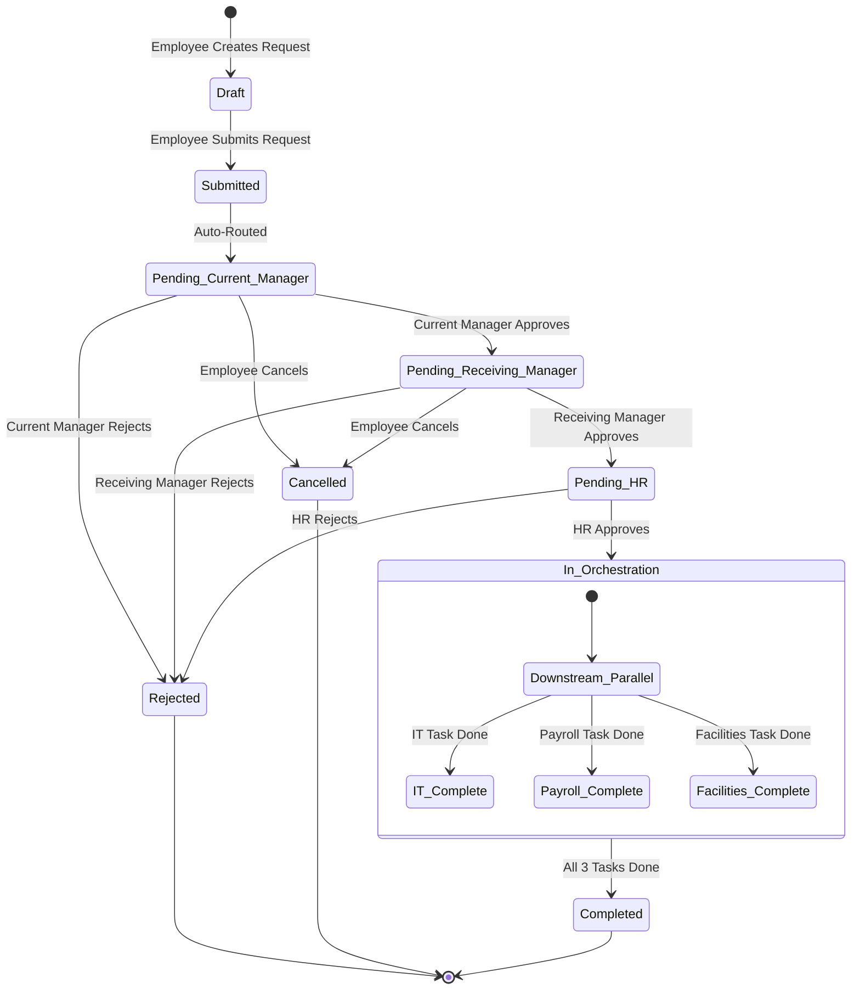

# System Architecture: Employee Internal Transfer Digital Journey

## 1. Architectural Style & Principles
The system is architected as a **Modular Monolith (Microservice Ready)**.
- **Modularity:** Domain capabilities are partitioned into distinct, decoupled modules (`transfers`, `approvals`, `orchestration`, `notifications`, `audit`).
- **Encapsulation:** Each module owns its business logic, validation rules, and data access models. Modules interact via well-defined internal interfaces or domain events.
- **Microservice Readiness:** Domain boundaries and data access are isolated such that individual modules can be extracted into standalone microservices without refactoring core business logic.

## 2. System Overview & Component Diagram

```mermaid
graph TD
    Client["React Frontend (Vite SPA)"] -->|REST API (JSON / JWT)| Gateway["API Gateway / Router (`/api/v1`)"]
    
    subgraph Backend ["Node.js Modular Backend"]
        Gateway --> AuthMiddleware["Auth & RBAC Middleware"]
        AuthMiddleware --> TransferModule["Transfer Request Module"]
        AuthMiddleware --> ApprovalModule["Approval Workflow Module"]
        AuthMiddleware --> OrchestrationModule["Downstream Orchestration Module"]
        AuthMiddleware --> NotificationModule["Notification & Audit Module"]
        
        TransferModule --> SharedDB[("PostgreSQL / Sequelize Database")]
        ApprovalModule --> SharedDB
        OrchestrationModule --> SharedDB
        NotificationModule --> SharedDB
    end

    subgraph DownstreamTasks ["Parallel Downstream Tasks"]
        OrchestrationModule --> IT["IT Access Provisioning"]
        OrchestrationModule --> Payroll["Payroll & Cost Center Update"]
        OrchestrationModule --> Facilities["Facilities & Desk Allocation"]
    end
```

## 3. Workflow State Machine
The transfer lifecycle follows a strict deterministic state machine:



## 4. Directory Structure & Execution Boundaries
```text
src/
├── frontend/
│   ├── app/                    # Routing, Global Providers, Layouts
│   ├── modules/
│   │   ├── transfers/          # Transfer Form, Request Details, Timeline
│   │   ├── approvals/          # Manager & HR Approval Dashboards
│   │   └── tasks/              # IT, Payroll, Facilities Task Worklists
│   └── shared/                 # UI Components, API Client, Auth Utilities
└── backend/
    ├── app/                    # Express App Setup, Middleware, Global Error Handlers
    ├── config/                 # Environment, Database, Security Settings
    ├── modules/
    │   ├── transfers/          # Transfer Controllers, Services, DTOs, Models
    │   ├── approvals/          # Multi-gate Approval Engine & History
    │   ├── orchestration/      # Downstream Task Orchestration Engine
    │   └── notifications/      # Notification Dispatcher & Audit Logger
    └── shared/                 # Database Connection, Errors, Middleware, Types
tests/
├── frontend/                   # React Component & Hook Tests
└── backend/                    # Domain Service, API Route, & Integration Tests
```
